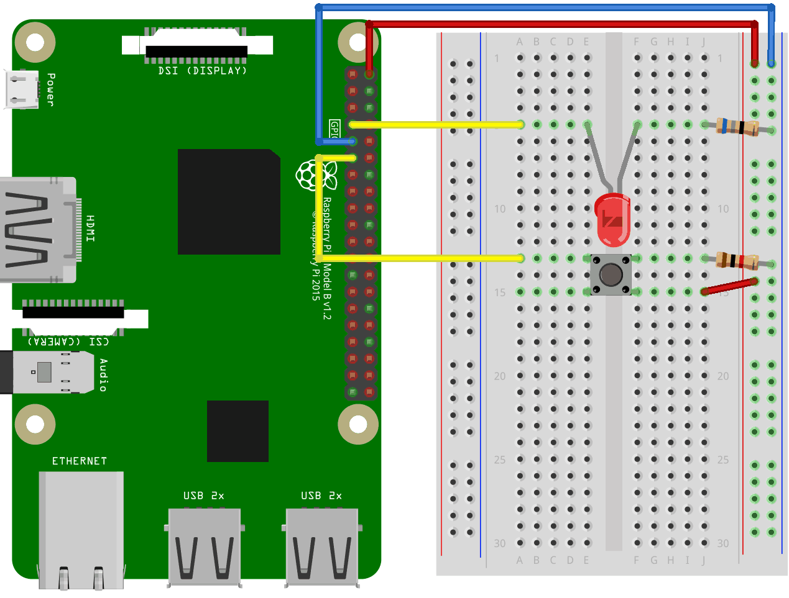
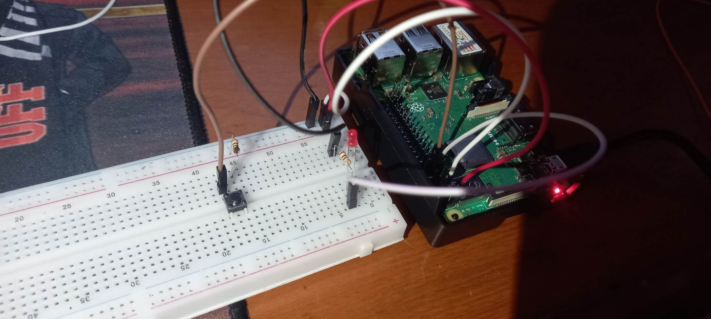

# # Thiết kế mạch điều khiển LED bằng BUTTON
### Linh kiện
Tên linh kiện | Số lượng
:---: | :---:
Led | 1
Điện trở | 2
Button | 1
### Sơ đồ mạch

### Chú thích
- `#define Led wPi` : Trong đó ***wPi*** là giá trị wPi tương ứng với chân vật lý cắm Led.
- `#define Button wPi` : Trong đó ***wPi*** là giá trị wPi tương ứng với chân vật lý cắm Button.