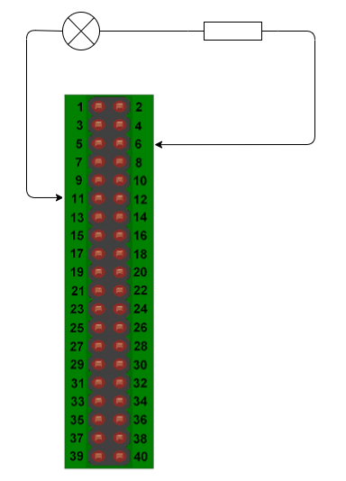
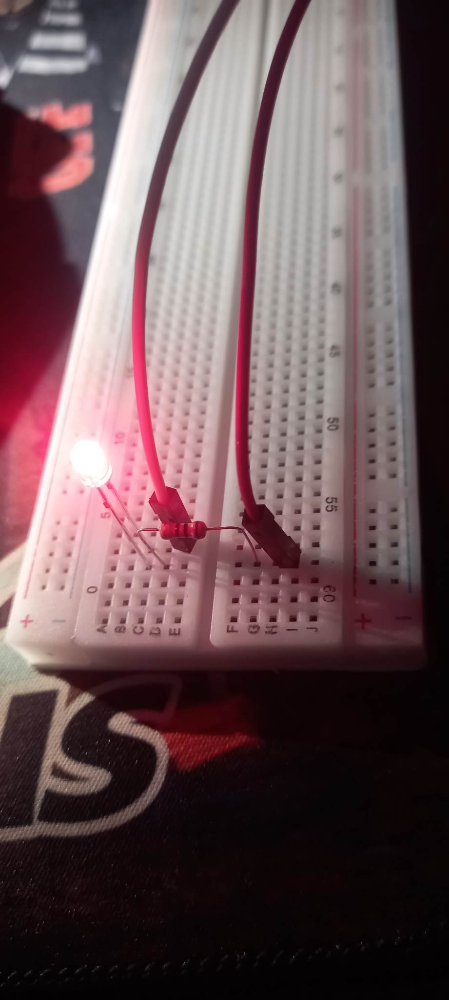

# Thiết kế mạch điều khiển LED nhấp nháy mỗi 500ms
### Linh kiện
Tên linh kiện | Số lượng
:---: | :---:
Led | 1
Điện trở | 1
### Sơ đồ mạch

### Chú thích
- `#define LED wPi` : Trong đó ***wPi*** là giá trị wPi tương ứng với chân vật lý cắm LED.